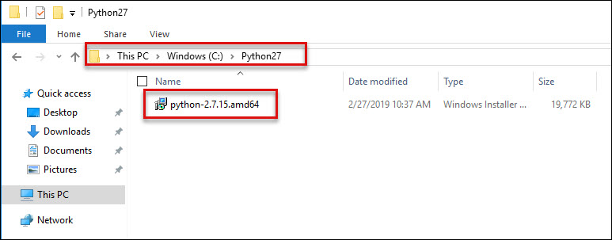
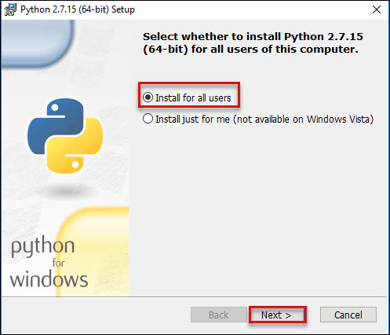
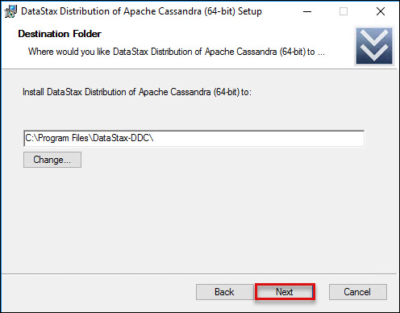

# Introduction to CosmosDB-Cassandra API.md

#### 1.1 Access Windows VM 
1.  **Launch** a browser and **navigate** to https://portal.azure.com. **Login** with your Microsoft Azure credentials.<br/>
2.  Click on the **Virtual Machines** icon on the **Menu navigation bar**.<br/>
<br/>
3.  Click on the **Powerbivm**<br/>
<br/>
4.  Click on **Connect** button. On clicking on Connect, the rdp file automatically gets downloaded. Open the downloaded file.<br/>
<br/>
5.  After Opening **RDP** file. In the remote desktop window that pops up, Click on **Connect**.<br/>
<bbr/>
6.  Now go to the Lab details page, which you have recieved after launching the lab. Copy the VMs **username** and **password** and enter into Enter your credentials page. Click on **OK**<br/>
<br/>
7.  Click on **Yes** in the pop up window.<br/>
<br/>
8. Now you can access you virtual machine.
<br/>

9. Follow the given steps to Install Python 2.7 version for cassandra migration
  
  a. Go to **C drive, select Pyhton27 Folder** and click on **python-2.7.15.amd64.msi** file.<br/> 
  <br/> 
  b. Select **Install for all users**, and then click **Next**.<br/>
  <br/> 
  c. Click **yes** if pop-up come and then press **next** button<br/>
  <br/> 
  d. On the directory selection screen, leave the directory as **Python27** and click **Next**.<br/> 
  <br/>
  e. Once the above step is completed, the installation of the official Python 2.7.11 interpreter will start on your Windows machine. When the setup is close to the finish, just click the **Finish** button like shown below.<br/>  
  <br>
  
10. Follow the given step for installing Datastax Cassandra Community :

   a. Go to **C drive > Program files > DataStax-DDC** and select the **datastax-ddc-64bit** file.
   <br/> 
   b. Run the **Datastax community edition** setup. After running the Setup, following page will be displayed. Click on **next**.<br/>
   <br/> 
   c. This page is about the license agreement. Mark the checkbox and press the **next** button.<br/>
   <br/> 
   d. This page is for installation location do not make any changes, press the **next** button.<br/>
   <br/> 
   e. Mark the checkboxes for automatically start Cassandra and press **nex**t button.<br/>
   <br/> 
   f. Setup has collected all the necessary information and now the setup is ready to install. Press **install** button.<br/>
   <br/> 
   g. After installation is completed, click on next button. When setup is installed successfully, press the **Finish** button.<br/>


## 1.2 Create a database account

Before you can create a document database, you need to create a Cassandra account with Azure Cosmos DB.

1. In a new browser window, sign in to the Azure portal.

2. Select Create a resource > Databases > Azure Cosmos DB.

3. In the Create Azure Cosmos DB Account page, enter the settings for the new Azure Cosmos DB account.<br/>
<br/>

   Click on **Review and Create**<br/>
<br/>

4. The account creation takes a few minutes. Wait for the portal to display the page saying Congratulations! Your Azure Cosmos DB account was created.<br/>

## 1.3. Create Keysapce and Table 

You need to create a keyspace and table for inserting and querying the the data using CQL.

1. In a new browser window, sign in to the Azure portal.

2. Click on Azure Cosmos DB icon, then select your azure cosmos db and click on Data Explore. Click on **New Keyspace** and give the setting values as per below:

<br/>

3. Once your **KeySpace** is ready, click on **New Table** for creating table and provide following instuctions :<br/>

a. Keyspace Name : **info**<br/>
b. Create Table info : **address**<br/>
c. Query :<br/>

```
(id text PRIMARY KEY, firstname text, lastname text, companyname text, address text, city text, country text, state text, zipcode text,phone text)
```

<br/>


## 3. Upload and Query sample data using cql

1.	Launch Command Promote as Administrator.

2. Change the directory using folowing command: <br/>
```
cd C:\Program Files\DataStax-DDC\apache-cassandra\bin
```
3. Run the following commands for SSL certification <br/>
```
set SSL_VERSION=TLSv1_2
set SSL_VALIDATE=false

```
<br/>

4. Go to Azure cosmos db, select the connection string and copy **CONTACT POINT**, **USERNAME** and **PRIMARY PASSWORD**. Paste these values for use in Notepad.<br/>

<br/>

5. Run the following command for connecting to Azure cosmos Cassandra API.<br/>

```
cqlsh.py <CONTACT POINT> -u <USERNAME> 10350 -p <PRIMARY PASSWORD> --ssl --cqlversion=3.4.4
```
<br/>
6. Use following command to uploading data to azure cosmos db:<br/>

```
COPY info.address FROM 'C:\cassandra-contacts.csv' WITH DELIMITER=',' AND HEADER=TRUE;
```
<br/>

7. Launch the Azure Portal, go to your azure cosmos db account, select Data Explorer and refresh the data. You will see that the data has been uploaded.<br/>

<br/>
8. Click on Rows > CQL Query Text and Click Run<br/>

<br/>
